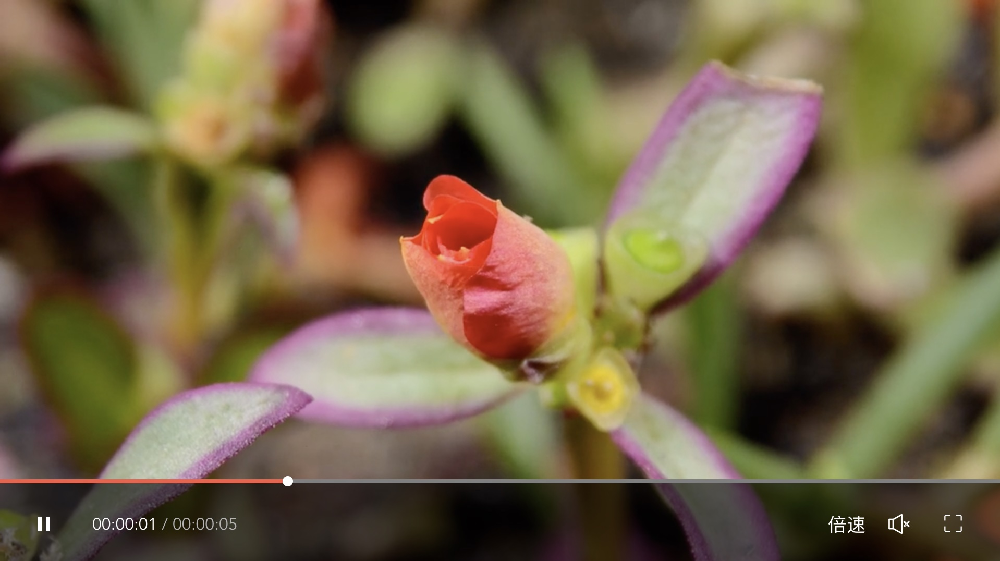
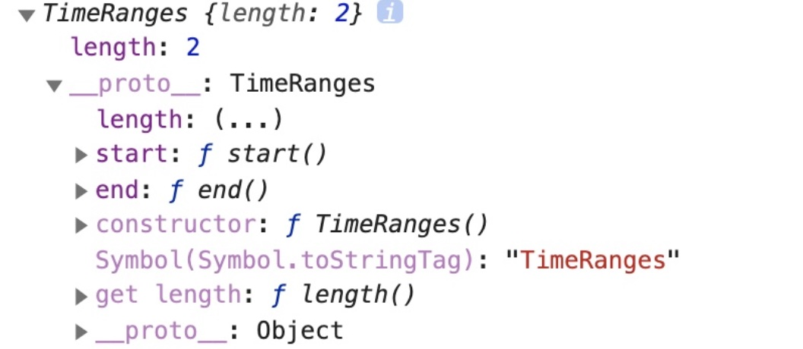
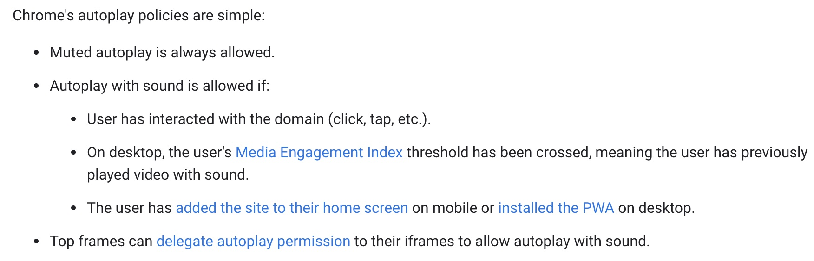

# Custom VideoPlayer 

## Project setup
```
npm install
```

### Compiles and hot-reloads for development
```
npm run serve
```

## 基于 Vue 的自定义视频播放器

平时我们在视频网站看剧看电影的时候，会注意到视频播放器有“倍速播放”，“音量控制”，“暂停/播放”，“全屏/退出全屏”等功能，但是在不同的网站上，播放器拥有的功能以及样式各自不同。`<video>` 标签的默认样式在不同浏览器会不同，那么如何改变 `<video>` 标签在浏览器中的默认行为， 使其在不同浏览器中表现一样？ 

我已经完成一个自定义播放器的样板，除了拥有播放进度，暂停/播放按钮，全屏/退出全屏等等，还有倍速播放功能。接下来我就逐一讲解如何实现它拥有的特性，和在编写中遇到的一些问题。（样板使用了Vue，如果对其中的代码不清楚的地方，可以查看 Vue 官方文档[Vue官方文档](https://vuejs.org/v2/guide/)）

这是`<video>`标签在浏览器中的默认样式：


这是完成后的样板的样式：


```
<video controls>
    <source src="video/flower.webm" type="video/webm">
    <source src="video/flower.mp4" type="video/mp4">
    Sorry, your browser doesn't support embedded videos.
</video>
```
这是一段视频播放器的 html，关于播放器的特性属性是添加在 video 标签的，关于播放源的属性是添加在 source 标签的。要想播放器不带有默认样式，就在`<video>` 标签不要带上 `controls` 或者设置 `controls = false`。
于是它就变成这样了:


在编写之前我们需要清楚如何获取视频的信息，如何控制视频的播放？MDN 上有关于 HTML Video element(video)的[教程](https://developer.mozilla.org/en-US/docs/Web/HTML/Element/video)。 

通过[HTMLMediaElement](https://developer.mozilla.org/en-US/docs/Web/API/HTMLMediaElement)类，可以获取视频总时长: `duration`，获取视频当前播放进度: `currentTime`，设置播放音量: `volume`，设置播放速率: `playbackRate`。

调用 `video` 元素的 `play`, `pause` 方法来播放、暂停视频。
通过监听 `video` 元素的 `timeupdate` 事件来更新视频当前播放进度`currentTime`；
调用元素的 `requestFullscreen` 方法来显示全屏，
调用 `document` 的 `exitFullscreen` 方法来退出全屏；

有了这些知识储备之后就很快进行功能的开发了。
```
<video
  ref="videoRef"
  @loadstart="loadstart"
  @loadedmetadata="setVideoDuration"
  @timeupdate="mediaTimeupdate"
>
  <source
    :src="$props.url"
    :poster="$props.poster"
    :type="$props.type"
  />
</video>
```
```
data () {
  return {
    currentTime: 0, // 当前播放时间
    duration: 0, // 视频时长
  };
}
```
1. 获取视频总时长(`duration` 为只读属性)<br>
  在元数据加载完成会触发 `loadedmetadata` 事件，这个时候我们就可以获取视频总时长

```
setVideoDuration () {
  let ref = this.$refs.videoRef;
  if (ref) {
    this.currentTime = 0;
    this.duration = ref.duration;
  }
},
```

1. 获取和设置视频当前播放进度(`currentTime` 为可读写属性)
```
mediaTimeupdate () {
  if (this.$refs.videoRef) {
    let currentTime = this.$refs.videoRef.currentTime;
    this.currentTime = currentTime;
  }
}   
```

```
this.$refs.videoRef.currentTime = newV
```

3. 设置音量(`volume` 为可读写属性)
```
this.$refs.videoRef.volume = volume;   
```
4. 设置播放速率(`playbackRate` 为可读写属性)
```
this.$refs.videoRef.playbackRate = playbackRate;   
```

5. 播放、暂停视频

```
this.$refs.videoRef.play();
```
```
this.$refs.videoRef.pause();
```

6. 视频全屏，退出全屏。
  为了在不同的浏览器正确的调用 `requestFullscreen` 和 `exitFullscreen`，需要一个兼容的写法。这两个方法都返回一个Promise实例，可以通过这个实例的 `then` 和 `catch` 方法来判断是否成功的全屏或者退出全屏了。
```
function requestFullscreen (ele) {
  let promise = null;

  if (ele.requestFullscreen) {
    promise = ele.requestFullscreen();
  } else if (ele.mozRequestFullScreen) {
    promise = ele.mozRequestFullScreen();
  } else if (ele.webkitRequestFullScreen) {
    promise = ele.webkitRequestFullScreen();
  } else if (ele.msRequestFullscreen) {
    promise = ele.msRequestFullscreen();
  }
  catchFullScreenError(promise);

  return promise;
}

function exitFullscreen () {
  let promise = null;
  if (document.exitFullscreen) {
    promise = document.exitFullscreen();
  } else if (document.mozCancelFullScreen) {
    promise = document.mozCancelFullScreen();
  } else if (document.webkitCancelFullScreen) {
    promise = document.webkitCancelFullScreen();
  } else if (document.msExitFullscreen) {
    promise = document.msExitFullscreen();
  }
  catchFullScreenError(promise);

  return promise;
}

function catchFullScreenError (promise) {
  if (({}.toString.call(promise)) === '[object Promise]') {
    promise.then(() => {
    }).catch(err => {
      console.log(`Failed to enable full-screen mode: ${err.message} (${err.name})`);
    });
  }
}
```

### 拓展
除了上面谈到的功能，我们在实际需求开发中还有一些其他的要求，比如在视频网站需要对视频设置封面，在视频学习网站获取学员的学习时间来记录学习进度等等。

1. 设置视频封面
    这个很简单，对`source`标签的`poster`属性设为一张图片地址即可。
2. 获取视频播放时间

如果你在看到这个需求的时候打算通过计时器来完成，那么在实现过程肯定是极其复杂的，而且还可能不精确。浏览器给我们提供了 video 元素的 `played` 属性，如果视频有进行播放的话，它返回一个 `TimeRanges` 对象，该对象包含播放的媒体源的范围。

```
this.$refs.videoRef.played;
```
如果播放了00:00 到 00:30, 00:35 到 00:40, 00:50 到 01:00 的视频，这个 `TimeRanges` 对象的 length 属性就为 3， 通过 `TimeRanges.played.start(index)` 和 `TimeRanges.played.end(index)`;就可以获得每一个端的开始秒数和结束秒数。

如果用户在没有刷页面的情况下，又从 00:00 开始播放，播放到了 01:00，这个时候通过 `this.$refs.videoRef.played` 获取的 `TimeRanges` 的 length 属性就为1，start，end 分别是 0 和 60。对于用户真实的观看记录，这个属性就非常的便利。现在我们封装一下这个获取观看记录的方法。
```
function getPlayedDuration (bDetail = false) {
  let duration = 0;
  let detail = [];
  if (!this.$refs.videoRef) {
    return bDetail ? { duration: duration, detail: [] } : duration;
  } else {
    let played = this.$refs.videoRef.played;
    for (let i = 0; i < played.length; i++) {
      let start = played.start(i);
      let end = played.end(i);

      detail.push([start, end]);
      duration += end - start;
    }

    return bDetail ? { duration: duration, detail: detail } : duration;
  }
}
```

3. 视频自动播放
   如果你想视频加载完成后自动播放，需要在video标签添加autoplay属性。但是事实可能不会如你所愿，在Chrome中有个[自动播放策略](https://developers.google.com/web/updates/2017/09/autoplay-policy-changes#webaudio)，浏览器这篇文章需要科学上网，其中的策略内容如图所示：
   
   总结一下截图里面的内容：静音；媒体参与指数（MEI）分数满足；iframe 带有`allow="autoplay"`，这三种情况下，Chrome是允许自动播放的。

   有时候我们可能需要在视频开始播放之后做一些其他的事情，这是我就需要知道视频是否正常的自动播放了。

    video元素的play方法返回一个promise实例，我们就可以通过这个实例的then方法和catch方法来处理播放成功和播放失败的情况。
    ```
    if (this.$props.autoplay) {
      let instance = this.$refs.videoRef.play();
      // 在某些情况下无法调用播放器的 play 方法
      instance.then(() => {
        this.isPlay = true;
      }).catch(() => {
        this.isPlay = false;
      });
    }
    ```

    如果视频没有自动播放成功，你想当用户在页面有交互的时候播放视频，可以使用 AudioContext 方法。
    ```
    var context = null;
    window.onload = function() {
      var context = new AudioContext();
    }

    document.addEventListener('click', function() {
      context.resume().then(() => {
        console.log('Playback resumed successfully');
      });
    });
    ```

### 总结
到此完成探索如何自定义一个视频播放器，做一个知识点的总结：
* 获取视频总时长: `duration`；
* 设置获取视频当前播放进度: `currentTime`；
* 获取和设置播放音量: `volume`；
* 获取和设置播放速率: `playbackRate`；
* 调用 `video` 元素的 `play`, `pause` 方法来播放、暂停视频；
* 通过监听 `video` 元素的 `timeupdate` 事件来更新视频当前播放进度`currentTime`；
* 调用元素的 `requestFullscreen` 方法来显示全屏，调用 `document` 的 `exitFullscreen` 方法来退出全屏；
* 设置视频封面图：`source`标签的`poster`属性；
* “自动播放”不一定会自动播放；
* 获取视频播放的时间段: `played`。

以上探索代码的[传送门](https://github.com/LbHongYu/video-player)

**参考链接**：

https://developer.mozilla.org/en-US/docs/Web/HTML/Element/video

https://developer.mozilla.org/en-US/docs/Web/API/HTMLMediaElement

https://developer.mozilla.org/en-US/docs/Web/Guide/Audio_and_video_delivery/cross_browser_video_player

https://developers.google.com/web/updates/2017/09/autoplay-policy-changes#webaudio


